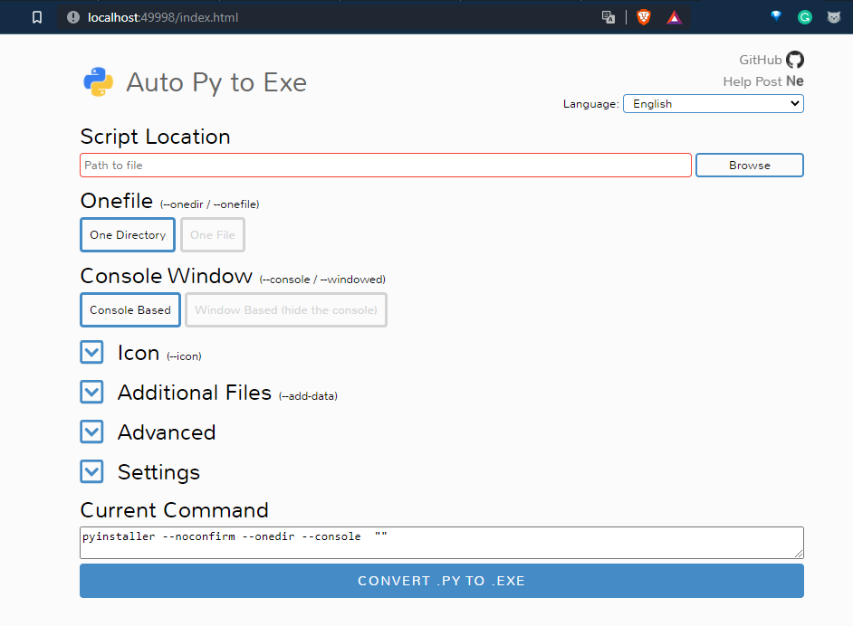
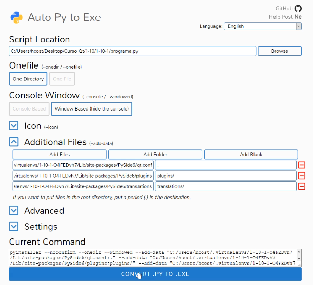

# process to create a .exe

1. pip install auto-py-to-exe

* [enter to pypi](https://pypi.org/project/auto-py-to-exe/) 
  
2. write **auto-py-to-exe --help** in console to watch options

3. Open writing "auto-py-to-exe -nc"

3. select your python file, image.ico and add external files adn folders

* if you are using others libraries, so add with folders
* the next image is config for pyqt5

